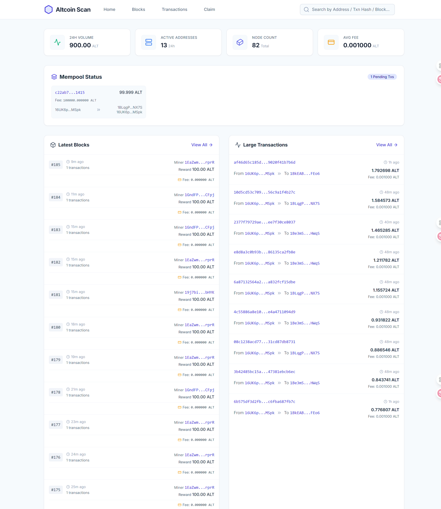
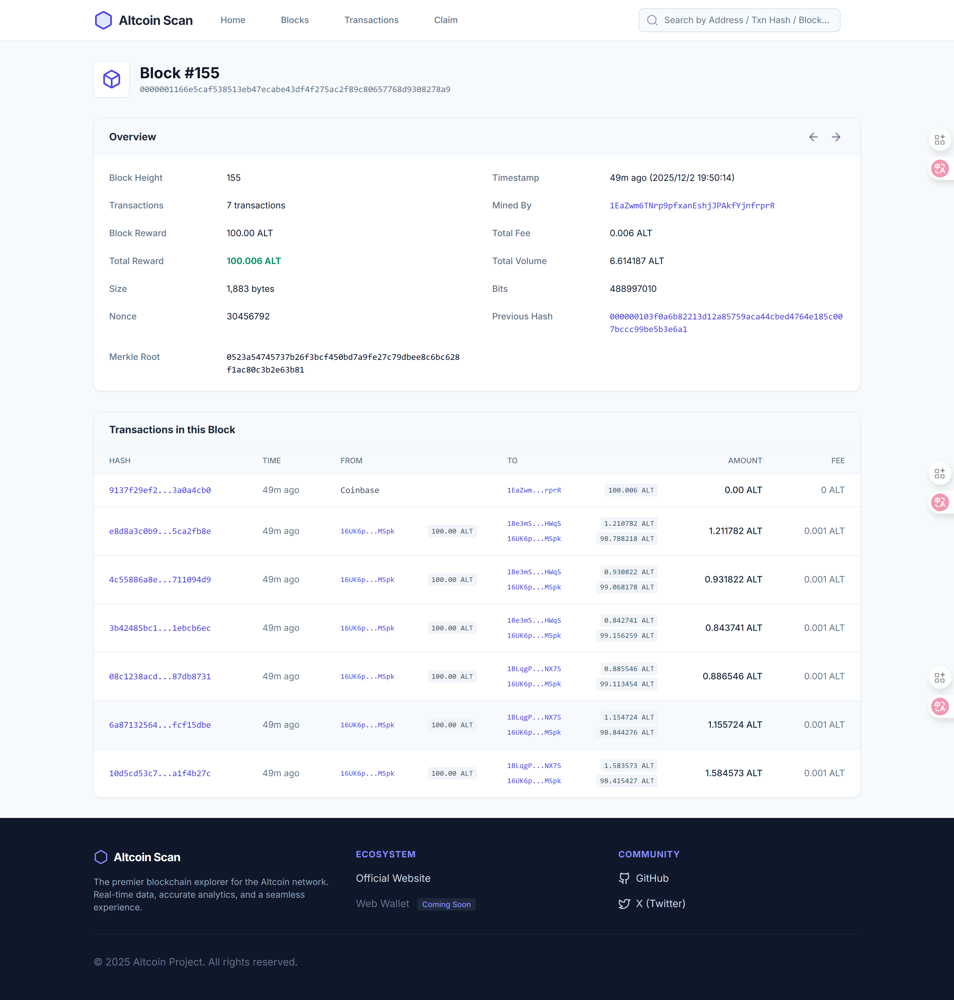
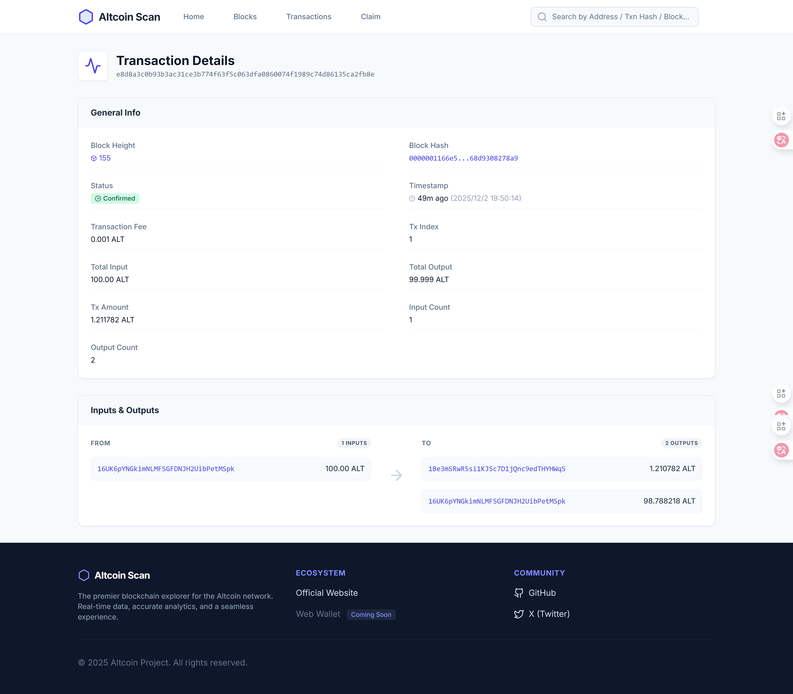
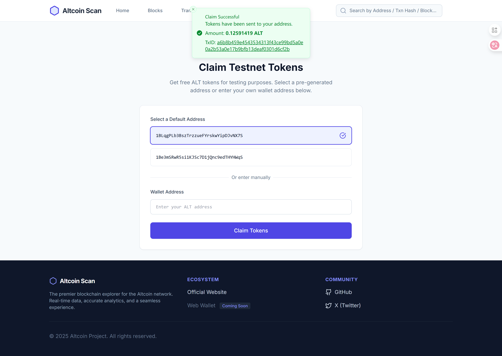

# Altcoin-Core: 一个从零实现的完整区块链项目

[](https://www.python.org/)
[](https://opensource.org/licenses/MIT)

[English](./README.md) | 简体中文

**项目源码:**
*   **后端 (本项目):** [https://github.com/cat80/altcoin-core/](https://github.com/cat80/altcoin-core/)
*   **前端 (区块链浏览器):** [https://github.com/cat80/altcoin-scan](https://github.com/cat80/altcoin-scan)

---

**Altcoin-Core** 是一个从零开始、不依赖任何现有区块链框架（如 Substrate, Cosmos SDK）构建的区块链系统。项目完整地实现了从底层核心存储、P2P网络、共识机制到上层RPC接口和命令行工具等模块。

该项目旨在实践并展示一个完整区块链系统的核心技术和工程实现。目前，项目已经部署了一个稳定的**测试网络**，并配有在线的**区块链浏览器**和RPC服务。

### ✨ **线上服务 (Testnet)**

*   **区块链浏览器:** [https://www.altcoin.host](https://www.altcoin.host) (内置水龙头功能)
*   **RPC 服务节点:** [https://rpc.altcoin.host](https://rpc.altcoin.host)
*   **P2P 种子节点:**
    *   `node1.altcoin.host:17890`
    *   `node2.altcoin.host:17890`

#### **浏览器截图**

| 首页 | 区块详情 |
| :---: | :---: |
|  |  |
| **交易详情** | **水龙头** |
|  |  |

---

## 🚀 架构与核心模块设计

### 1. **核心层 (`core`)**
负责定义区块链的基础数据结构（区块、交易）和核心业务逻辑。
*   **链状态与重组**: 围绕数据一致性进行设计，特别是对链重组（Reorg）过程做了细致处理。在处理分叉时，所有对UTXO集的操作会先在一个临时的内存视图 (`ChainStateCacheView`) 中进行，验证通过后再原子性地更新主状态。同时设计了撤销记录 (`UndoRecord`) 来保证回滚操作的准确性。
*   **组件职责分离**: `Blockchain` 类作为协调者，负责调度 `BlockStorage` (存储), `BlockIndex` (索引), `ChainState` (UTXO状态) 和 `BlockValidator` (验证) 等多个组件。

### 2. **P2P网络层 (`p2p`)**
负责节点间的发现、通信和数据同步，采用分层设计和多种通信模式。
*   **事件驱动与解耦**: 基于 `asyncio` 实现了一个事件总线 (`EventBus`)，用于模块间的异步通信，避免了模块间的直接调用。
*   **混合通信模式**: 同时支持用于信息扩散的 **Gossip 协议**和用于精确数据请求的 **Request-Response** 模式。
*   **后台连接维护**: `PeerManager` 中包含一个后台任务 (`_maintenance_loop`)，它会定期检查并维持一个目标数量的节点连接，以保证节点在网络中的连通性。

### 3. **共识层 (`consensus`)**
负责新区块的生成和验证，即挖矿。
*   **PoW 共识**: 实现了基于工作量证明的共识算法。
*   **多进程挖矿**: 为了克服Python的全局解释器锁（GIL）对CPU密集型任务的限制，挖矿过程通过**进程池 (`ProcessPoolExecutor`)** 来实现。这使得挖矿任务可以并行执行，有效利用了服务器的多核CPU资源。

### 4. **内存池 (`mempool`)**
作为交易进入区块链之前的缓冲区。
*   **交易收集与验证**: 负责从P2P网络收集广播的交易，并对交易的签名、结构和UTXO有效性进行初步验证。
*   **交易打包**: 为共识层的矿工提供待打包的交易列表，矿工从中选择交易并构建新的区块。

### 5. **索引器 (`indexer`)**
为了给RPC接口提供快速的数据查询能力，设计了索引器模块。
*   **数据解析与索引**: 索引器会监听新区块事件，解析区块中的每一笔交易，并根据地址、交易哈希等关键信息建立索引。这避免了在查询时需要遍历整个区块链的低效操作。

### 6. **RPC接口层 (`rpc`)**
提供了一套标准的JSON-RPC接口，作为外部世界与区块链交互的桥梁。
*   **API 设计**: 基于 **FastAPI** 构建，提供了包括查询区块、交易、地址信息在内的多种接口，供钱包、浏览器等上层应用调用。
*   **服务启动**: RPC服务与P2P服务在同一个进程中启动，但监听在不同的端口上，端口号通过 `1000 + p2p_port % 100` 的方式计算得出。

### 7. **应用层 (钱包与前端)**
*   **命令行钱包 (`cmd`)**: 一个功能丰富的本地命令行工具，它通过调用RPC接口来实现创建账户、查询余额、发起转账等操作。
*   **区块链浏览器 (`altcoin-scan`)**: 这是一个独立的 **React** 前端项目，它通过公开的RPC服务节点获取链上数据，并以友好的图形化界面进行展示。它与后端 `altcoin-core` 完全分离，是RPC接口的一个典型应用案例。

---

## 本地启动指南

1.  **克隆代码**:
    ```bash
    git clone https://github.com/cat80/altcoin-core.git
    cd altcoin-core
    ```

2.  **切换到测试网分支**:
    `testnet` 分支包含了连接到线上测试网络所需的配置。
    ```bash
    git checkout testnet
    ```

3.  **安装依赖**:
    ```bash
    pip install -r requirements.txt
    ```

4.  **启动节点**:
    ```bash
    python src/main.py
    ```
    *   节点将默认在 `17890` 端口上运行P2P服务。
    *   RPC服务将默认在 `8090` 端口上。

---

## 代码提交规范

项目遵循一定的代码提交规范，以保持历史记录的清晰。Commit message 应遵循以下格式：
`<type>: <subject>`

常用的 `type` 包括：
*   **feat**: 新功能 (feature)
*   **fix**: 修补bug
*   **docs**: 文档 (documentation)
*   **style**: 格式 (不影响代码运行的变动)
*   **refactor**: 重构 (即不是新增功能，也不是修改bug的代码变动)
*   **test**: 增加测试
*   **chore**: 构建过程或辅助工具的变动

---

## 节点运行配置

对于想要在服务器上长期运行节点的用户，建议使用以下最低配置：
*   **CPU**: 2 核
*   **内存**: 4 GB
*   **硬盘**: 50 GB SSD
*   **操作系统**: Linux (Ubuntu, CentOS, etc.)

---

## 📖 RPC API 核心接口示例

项目提供了一系列 RPC 接口，方便与区块链进行交互。以下是几个核心接口的示例，更详细的列表请参考 `src/rpc/rpc_server.py`。

*   **广播一笔裸交易**
    *   `POST /rpc/tx/send`
    *   **Body**: `{ "hex": "<raw_tx_hex>" }`
    *   **功能**: 接收十六进制编码的裸交易，验证后放入内存池并向全网广播。

*   **根据高度查询区块信息**
    *   `GET /rpc/block/height/{height}`
    *   **功能**: 返回指定高度区块的详细信息，包括区块头、所有交易列表等。

*   **查询地址信息**
    *   `GET /rpc/address/{address}`
    *   **功能**: 返回指定地址的摘要信息，包括当前余额、总发送、总接收和交易总数。

*   **获取地址的可用UTXO**
    *   `GET /rpc/address/{address}/utxos`
    *   **功能**: 返回指定地址所有未花费的交易输出（UTXO），这是构建新交易的基础。

> 完整的接口定义和实现，请直接参考 `src/rpc/rpc_server.py` 文件。

---

## 授权协议

本项目采用 MIT 授权协议。
